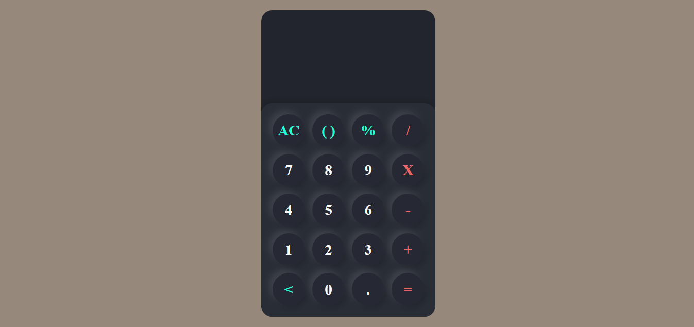

<h1 align="center"> <a href="https://gustavo-freita.github.io/Calculadora/">Calculadora</a></h1>

  
  

`Objetivo do projeto:` Testar mais ainda o quanto eu estou aprendendo de JavaScript e treinar minha lógica de programação junto. 

 

<h3 align="center">👩🏽‍💻 Tecnologias Utilizadas</h3>   

* HTML;
* CSS;
* JavaScript.
